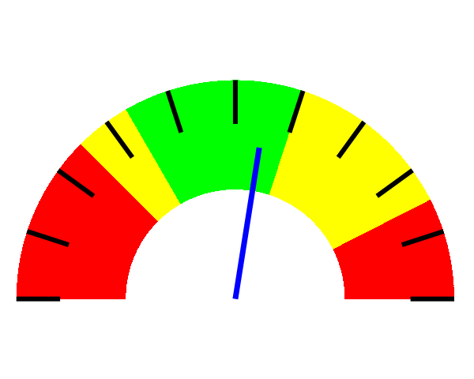

##Description

Creates a clockface in gnuplot given the hour, minute, and second.

Creates a speedometer-style dial given a value and a maximum value.

##Prerequisites

gnuplot: obtained using `brew install gnuplot` on MacOS or `apt-get install gnuplot` on Linux

bash (for the demo shell script)

SVG viewer of your choice: Google Chrome or Firefox should work

##Running the clock face demo

`bash generate_clock_face.sh`

`google-chrome clock.svg` (if using Google Chrome as the SVG viewer)

`firefox clock.svg` (if using Firefox as the SVG viewer)

##Running the speedometer-style dial demo

`bash generate_dial.sh`

`google-chrome dial.png` (if using Google Chrome as the PNG viewer)

`firefox dial.png` (if using Firefox as the PNG viewer)
